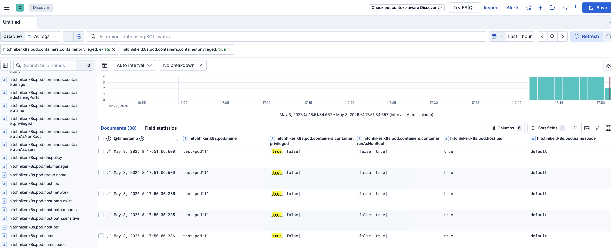

# K8S-DETECTION-PIPELINE

A Kubernetes-native security detection pipeline that collects, enriches, and ships
runtime security events from Falco, Tetragon, and workload logs to Elasticsearch via Kafka.

The core enrichment layer is **Hitchhiker** — a Mutating Admission Webhook that captures
pod security context at admission time and makes it available for downstream correlation,
without any join at query time.

---

## Architecture

### Pipeline 1 — Runtime Event Collection (Fluent Bit)

```
┌─────────────────────────────────────────────────────────────────────┐
│                     Kubernetes Cluster                              │
│                                                                     │
│  ┌─────────────────┐   ┌──────────────────┐   ┌──────────────────┐  │
│  │   Hitchhiker    │   │     Falco        │   │    Tetragon      │  │
│  │ (Mutating       │   │  (DaemonSet)     │   │  (DaemonSet)     │  │
│  │  Admission      │   │                  │   │                  │  │
│  │  Webhook)       │   │ syscall + K8s    │   │ eBPF process     │  │
│  │                 │   │ audit events     │   │ tracing          │  │
│  │ Pod metadata    │   │ → stdout (JSON)  │   │ → stdout (JSON)  │  │
│  │ → Redis store   │   │                  │   │                  │  │
│  └────────┬────────┘   └────────┬─────────┘   └────────┬─────────┘  │
│           │                     │                      │            │
│           ▼                     ▼                      ▼            │
│        Redis          ┌──────────────────────────────────────────┐  │
│                       │           Fluent Bit (DaemonSet)         │  │
│                       │                                          │  │
│                       │  INPUT:  tail /var/log/containers/*.log  │  │
│                       │  FILTER: kubernetes (metadata)           │  │
│                       │  FILTER: record_modifier (source_type)   │  │
│                       │  OUTPUT: Kafka                           │  │
│                       └────────────────────┬─────────────────────┘  │
└────────────────────────────────────────────│────────────────────────┘
                                             │
                                             ▼
                                ┌────────────────────────┐
                                │        Kafka           │
                                │                        │
                                │      siem-falco        │
                                │      siem-tetragon     │
                                │      siem-k8s          │
                                │      siem-k8s-audit    │
                                │      siem-kyverno      │
                                └───────────┬────────────┘
                                            │
                                            ▼
                                ┌────────────────────────┐
                                │        Logstash        │
                                │                        │
                                │  ECS normalization     │
                                │  Redis lookup          │◄── Hitchhiker
                                │  (planned)             │    metadata
                                └───────────┬────────────┘
                                            │
                                            ▼
                                ┌────────────────────────┐
                                │     Elasticsearch      │
                                │      + Kibana          │
                                │                        │
                                │   logs-falco-siem      │
                                │   logs-tetragon-siem   │
                                │   logs-kubernetes-siem │
                                └────────────────────────┘
```

### Pipeline 2 — K8s Audit Log Collection

Audit logs carry `objectRef.name` (pod name) but often no pod UID.
Hitchhiker stores a secondary key `hitchhiker-k8s-{cluster_name}/{namespace}/{name}`
so Logstash can look up pod security context even without a UID.

**Self-hosted:**

```
┌─────────────────────────────────────────────────────────────────────┐
│                     Kubernetes Cluster                              │
│                                                                     │
│  kube-apiserver ──► audit log ──► Falco (port 9765)                 │
│                                        │                            │
└────────────────────────────────────────│────────────────────────────┘
                                         │
                                         ▼
                              ┌────────────────────────┐
                              │        Kafka           │
                              │    siem-k8s-audit      │
                              └───────────┬────────────┘
                                          │
                                          ▼
                              ┌────────────────────────┐
                              │        Logstash        │
                              │                        │
                              │  ECS normalization     │
                              │  Redis lookup          │◄── Hitchhiker
                              │  (planned)             │    metadata
                              └───────────┬────────────┘
                                          │
                                          ▼
                              ┌────────────────────────┐
                              │     Elasticsearch      │
                              └────────────────────────┘
```

**EKS:**

```
┌─────────────────────────────────────────────────────────────────────┐
│                         EKS Cluster                                 │
│                                                                     │
│  kube-apiserver ──► CloudWatch Logs (/aws/eks/<cluster>/cluster)    │
│                                                                     │
└────────────────────────────────────────│────────────────────────────┘
                                         │ Subscription Filter
                                         ▼
                              ┌────────────────────────┐
                              │        Lambda          │
                              │  cloudwatch-to-kafka   │
                              │                        │
                              │  - IRSA                │
                              │  - VPC-attached        │
                              │  - injects source_type │
                              └───────────┬────────────┘
                                          │
                                          ▼
                              ┌────────────────────────┐
                              │       AWS MSK          │
                              │    siem-k8s-audit      │
                              └───────────┬────────────┘
                                          │
                                          ▼
                              ┌────────────────────────┐
                              │        Logstash        │
                              │                        │
                              │  ECS normalization     │
                              │  Redis lookup          │◄── Hitchhiker
                              │  (planned)             │    metadata
                              └───────────┬────────────┘
                                          │
                                          ▼
                              ┌────────────────────────┐
                              │     Elasticsearch      │
                              └────────────────────────┘
```

---

## Hitchhiker Metadata in Kibana

Hitchhiker-enriched fields (`hitchhiker.k8s.pod.*`) are queryable across all security events.
The example below shows privileged container detection — `[true, false]` indicates a multi-container
pod where at least one container runs as privileged and the other does not.



---

## Quick Start

```bash
# Self-hosted cluster
./scripts/deploy.sh --env self-hosted --cluster-name <cluster-name>

# EKS
./scripts/deploy.sh --env eks --cluster-name <cluster-name>

# Uninstall
./scripts/uninstall.sh --env self-hosted
./scripts/uninstall.sh --env eks
```

**Requirements:** `kubectl`, `helm`, `git`

| | self-hosted | eks |
|---|---|---|
| Storage (local-path-provisioner) | ✅ | ❌ |
| Audit webhook (kube-apiserver) | ✅ requires `sudo` | ❌ |
| K8s audit via CloudWatch + Lambda | ❌ | ✅ |
| Kafka | Strimzi | AWS MSK |
| Fluent Bit output broker | in-cluster | MSK |

---

## Components

### Hitchhiker

A Mutating Admission Webhook (Python) that captures pod security context at admission time
and stores it in Redis. Downstream pipelines look up this metadata by pod UID to correlate
security events with workload context without any join at query time.

The core problem it solves: runtime security events from Falco, Tetragon, and audit logs carry
a pod UID or name, but no security context. Without enrichment, you cannot tell from an alert
alone whether the pod was privileged, had hostPath mounts, or used a sensitive ServiceAccount.

**Redis key format:**

| Key | Purpose |
|---|---|
| `hitchhiker-k8s-{pod-uid}` | Primary key — UID is globally unique across clusters |
| `hitchhiker-k8s-{cluster_name}/{namespace}/{name}` | Secondary key — for audit log lookup where UID is absent |

**UID resolution:** Pods created via Deployment → ReplicaSet arrive at the webhook before
the API server assigns a UID. Hitchhiker resolves the UID post-admission by querying the K8s API
using `pod-template-hash` as a label selector, then stores metadata under both keys.

### Fluent Bit

DaemonSet that collects container logs from every node.

- **Input**: `tail` on `/var/log/containers/*.log` — separate inputs per source (Falco, Tetragon, Kyverno, workload)
- **Filter**: `kubernetes` — enriches with pod labels, namespace, node info
- **Filter**: `record_modifier` — adds `cluster_name` and `source_type`
- **Output**: Kafka
- **Structure**: Kustomize base/overlay (self-hosted / eks)

### Kafka

| Topic | Source |
|---|---|
| `siem-falco` | Falco syscall + audit alerts |
| `siem-tetragon` | Tetragon eBPF process events |
| `siem-k8s` | K8s workload logs |
| `siem-k8s-audit` | K8s API server audit logs |
| `siem-kyverno` | Kyverno policy events |

Self-hosted uses [Strimzi](https://strimzi.io/). EKS uses AWS MSK.

### Logstash

| File | Role |
|---|---|
| `0000_input.conf` | Kafka consumer for all siem-* topics |
| `0200_filter_falco.conf` | ECS mapping — `rule.*`, `process.*`, `event.kind: alert` |
| `0201_filter_tetragon.conf` | ECS mapping — `process.*`, event type routing |
| `0202_filter_k8s.conf` | ECS mapping — K8s workload logs |
| `0203_filter_k8s_audit.conf` | ECS mapping — `event.action`, `user.name`, `kubernetes.audit.*` |
| `9999_output.conf` | Routes to Elasticsearch indices |

> **Planned:** Logstash Ruby plugin will look up `hitchhiker-k8s-{pod-uid}` from Redis
> and inject Hitchhiker metadata into each event at pipeline time.

### Lambda (EKS only)

Forwards K8s audit logs from CloudWatch Logs to Kafka in real-time.

- Triggered by CloudWatch Subscription Filter — no polling
- Runs inside VPC with IRSA — no static credentials
- Injects `source_type: k8s-audit` for Logstash routing

### ECK (Elasticsearch + Kibana)

Deployed via Elastic Cloud on Kubernetes operator.

- Elasticsearch 9.x — NodePort 9200
- Kibana 9.x — NodePort 30561

---

## ECS Field Mapping

All events are mapped to [Elastic Common Schema (ECS) 8.x](https://www.elastic.co/guide/en/ecs/current/index.html).

**Common fields (Fluent Bit → Elasticsearch)**

```
host.name                    ← kubernetes.host
container.name               ← kubernetes.container_name
container.image.name         ← kubernetes.container_image
container.id                 ← kubernetes.docker_id
orchestrator.cluster.name    ← cluster_name
orchestrator.namespace       ← kubernetes.namespace_name
orchestrator.resource.name   ← kubernetes.pod_name
orchestrator.resource.ip     ← kubernetes.pod_ip
orchestrator.type            → "kubernetes"
```

**Hitchhiker → Redis (Pod level)**

| Field | Description |
|---|---|
| `hitchhiker.k8s.pod.uid` | Pod UID |
| `hitchhiker.k8s.pod.name` | Pod name |
| `hitchhiker.k8s.pod.namespace` | Namespace |
| `hitchhiker.k8s.pod.user.name` | Username that created the pod |
| `hitchhiker.k8s.pod.group.name` | Groups of the creating user |
| `hitchhiker.k8s.pod.serviceaccount` | ServiceAccount name |
| `hitchhiker.k8s.pod.fieldmanager` | Field manager (e.g. kubectl, helm) |
| `hitchhiker.k8s.pod.owner.kind` | Owner kind (Deployment, ReplicaSet, etc.) |
| `hitchhiker.k8s.pod.owner.name` | Owner name |
| `hitchhiker.k8s.pod.host.pid` | hostPID enabled |
| `hitchhiker.k8s.pod.host.network` | hostNetwork enabled |
| `hitchhiker.k8s.pod.host.ipc` | hostIPC enabled |
| `hitchhiker.k8s.pod.host.path.mounts` | hostPath mount paths |
| `hitchhiker.k8s.pod.host.path.sensitive` | Sensitive paths (/etc, /proc, etc.) |
| `hitchhiker.k8s.pod.host.path.exist` | hostPath volumes present |

**Hitchhiker → Redis (Container level, per container)**

| Field | Description |
|---|---|
| `container.name` | Container name |
| `container.image` | Image |
| `container.privileged` | Privileged mode |
| `container.allowPrivilegeEscalation` | allowPrivilegeEscalation |
| `container.runAsUser` | runAsUser |
| `container.runAsNonRoot` | runAsNonRoot |
| `container.capabilities.added` | Added Linux capabilities |
| `container.capabilities.dropped` | Dropped Linux capabilities |
| `container.listeningPorts` | Declared container ports |

> **Note:** `[true, false]` values in container-level fields indicate a multi-container pod
> where each container has a different security context value.

---

## Detection Use Cases

With Hitchhiker metadata available per pod UID, the following queries are available in Kibana:

```kql
# Privileged container detected
hitchhiker.k8s.pod.containers.container.privileged: true

# Pod with sensitive hostPath mounts triggered a Falco alert
hitchhiker.k8s.pod.host.path.sensitive: true AND event.module: falco

# Process execution in a container running as root
hitchhiker.k8s.pod.containers.container.runAsNonRoot: false AND event.module: tetragon

# Container with added Linux capabilities
hitchhiker.k8s.pod.containers.container.capabilities.added: *

# Secret enumeration via kubectl
kubernetes.audit.objectRef.resource: secrets AND
event.action: (get OR list) AND
event.outcome: success

# kubectl exec into a pod
kubernetes.audit.objectRef.resource: pods AND
kubernetes.audit.objectRef.subresource: exec

# ClusterRoleBinding created
event.action: create AND
kubernetes.audit.objectRef.resource: clusterrolebindings
```

---

## Directory Structure

```
k8s-detection-pipeline/
├── scripts/
│   ├── deploy.sh                    # Main deploy entrypoint (--env, --cluster-name)
│   ├── uninstall.sh                 # Full teardown
│   └── lib/
│       ├── common.sh                # Logging, helpers, wait functions
│       ├── cert-manager.sh
│       ├── eck.sh
│       ├── kafka.sh
│       ├── falco.sh                 # Includes audit webhook config for self-hosted
│       ├── hitchhiker.sh
│       ├── fluent-bit.sh
│       ├── logstash.sh
│       └── storage.sh               # local-path-provisioner (self-hosted only)
├── hitchhikers/
│   ├── enrich.py                    # Webhook payload parsing, UID resolution, Redis store
│   └── k8s/
│       └── manifests.yaml           # SA + RBAC + Deployment + Service + MutatingWebhookConfiguration
├── elastic/
│   ├── elasticsearch.yaml
│   └── kibana.yaml
├── kafka/
│   ├── kafka.yaml                   # Strimzi Kafka cluster
│   └── topics.yaml                  # siem-* topics
├── falco/
│   └── values.yaml                  # Helm values (json_output: true, stdout_output: true)
├── fluent-bit/
│   ├── base/                        # Kustomize base (common configmaps, daemonset, rbac)
│   └── overlays/
│       ├── self-hosted/             # Self-hosted output config
│       └── eks/                     # EKS output config (MSK brokers)
├── logstash/
│   └── configmap-pipeline.yaml      # Consolidated Logstash pipeline
└── lambda/
    └── cloudwatch_to_kafka/
        ├── main.py                  # CloudWatch → Kafka forwarder (EKS only)
        └── builder.sh
```

---

## License

Copyright 2026 jaypark81
Licensed under the Apache License, Version 2.0.
See LICENSE for details.
